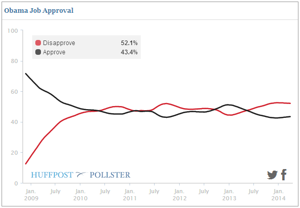
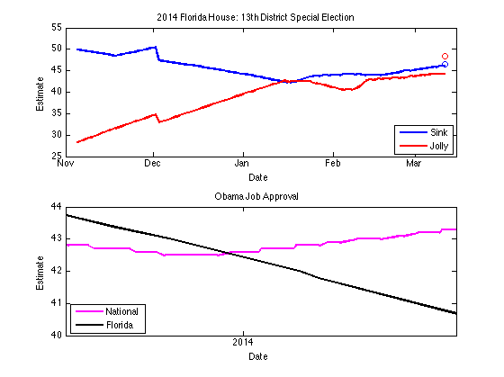

Election Poll Analysis in MATLAB
========================================================

Availability of abundant data, coupled with a very impressive success of a complete outsider, Nate Silver, to make the perfect call in the last two presidential elections, turned election poll analysis one of a fertile playgrounds for hobbyists to apply their data analytics skills for fun.

This analysis starts out with a simple example, and then look at the example of recent outcome of the special congressional election in Florida to find out - **does national politics affect local elections?**

Pollster API
------------
[Pollster API](http://elections.huffingtonpost.com/pollster/api) provides convenient access to the data from election polls. There are other websites that aggregate election polls, this API was the easiest to use.

Let's start out with a 'hello, world' example of getting data for Obama Job Approval Ratings.

<pre><code>clearvars;close all;clc;

baseUrl='http://elections.huffingtonpost.com/pollster/api/charts';
slug = 'obama-job-approval';
respFormat = 'json';
fullUrl = sprintf('%s/%s.%s',baseUrl,slug,respFormat);

clearvars baseUrl respFormat slug
</code></pre>

Read JSON data using JSONlab
----------------------------
Install [JSONlab](http://www.mathworks.com/matlabcentral/fileexchange/33381-jsonlab-a-toolbox-to-encodedecode-json-files-in-matlaboctave) from FileExchange before running script, and change the addpath to your installed location of JSONlab.

<pre><code>addpath ../jsonlab_1.0alpha/jsonlab;

data=loadjson(urlread(fullUrl));
disp(data)

clearvars fullUrl
</code></pre>

<pre>
                title: 'Obama Job Approval'
                 slug: 'obama-job-approval'
                topic: 'obama-job-approval'
                state: 'US'
          short_title: 'Obama Job Approval'
           poll_count: 2512
         last_updated: '2014-03-28T14:23:07Z'
                  url: 'http://elections.huffingtonpost.com/pollster/obama...'
            estimates: {[1x1 struct]  [1x1 struct]  [1x1 struct]}
    estimates_by_date: {1x1032 cell}
</pre>

Convert the data into a table
-----------------------------
JSON stores data in nested tree structure like XML, so we need to convert it into a table in order to use the data in MATLAB.

<pre><code>% initialize variables
estimates=data.estimates_by_date;
date = zeros(length(estimates),1);
approve = zeros(length(estimates),1);
disapprove = zeros(length(estimates),1);
undecided = zeros(length(estimates),1);

% loop over JSON tree
for i = 1:length(estimates)
    date(i) = datenum(estimates{i}.date);
    for j = 1:length(estimates{i}.estimates)
        if strcmpi('approve',estimates{i}.estimates{j}.choice)
            approve(i) = estimates{i}.estimates{j}.value;
        elseif strcmpi('disapprove',estimates{i}.estimates{j}.choice)
            disapprove(i) = estimates{i}.estimates{j}.value;
        else
            undecided(i) = estimates{i}.estimates{j}.value;
        end
    end
end

% consolidate the data into a table
estimates = table(date,approve,disapprove,undecided);

disp(estimates(1:5,:))

clearvars date approve disapprove undecided i j
</code></pre>

<pre>
       date       approve    disapprove    undecided
    __________    _______    __________    _________

    7.3568e+05    43.4       52.1            0      
    7.3568e+05    43.4       52.1          4.4      
    7.3568e+05    43.4       52.1          4.4      
    7.3568e+05    43.4       52.1          4.4      
    7.3568e+05    43.4       52.2          4.4   
</pre>

Remove missing values
---------------------

Real data is never perfect, so we need to Check for missing values and remove affected rows

<pre><code>% get the indices of zero values
isMissing=table2array(estimates) == 0;
% get the count of missing values by variable
disp('number of missing values by variable')
disp(array2table(sum(isMissing),'VariableNames',...
    estimates.Properties.VariableNames));
disp('rows to drop for approve/disapprove')
disp(estimates(isMissing(:,2),:))

obamaDecided = estimates(~isMissing(:,2),1:3);
obamaUndecided = estimates(~isMissing(:,4),[1 4]);

clearvars isMissing
</code></pre>

<pre>
number of missing values by variable
    date    approve    disapprove    undecided
    ____    _______    __________    _________

    0       2          2             196      

rows to drop for approve/disapprove
       date       approve    disapprove    undecided
    __________    _______    __________    _________

    7.3515e+05    0          0               4      
    7.3382e+05    0          0             9.6    
</pre>

Get a summmary statistics of the variables
------------------------------------------

This gives you the min, max and median for numerical variables.

<pre><code>summary(obamaDecided)</code></pre>

<pre>
Variables:

    date: 1030x1 double
        Values:

            min       7.3374e+05
            median    7.3467e+05
            max       7.3568e+05

    approve: 1030x1 double
        Values:

            min       42.5     
            median    46.9     
            max       71.6     

    disapprove: 1030x1 double
        Values:

            min        12.5       
            median    47.85       
            max        52.5       
</pre>

Plotting Obama Job Approval
---------------------------
In the final step, let's validate the data processing so far by plotting the data and compare it the chart on Pollster website.

<pre><code>figure
plot(obamaDecided.date,obamaDecided.approve,'k-','LineWidth',2)
hold on
plot(obamaDecided.date,obamaDecided.disapprove,'r-','LineWidth',2)
h = plot(obamaUndecided.date,obamaUndecided.undecided,'b-','LineWidth',2);
set(h, 'color', [0.7 0.7 0.7])
datetick
xlabel('Date')
ylabel('Estimate')
legend('Approve','Dispprove','Undecided','Location','East')
title(data.title)
xlim([datenum('2009-01-01') Inf])
hold off

clearvars h
</code></pre>

Does national politics affect local election?
---------------------------------------------

There was a race in Florida recently that was supposedly a test case for how Obama's healthcare law impacts the mid-term election. Or is it?

Let's get the data, but this time, let's use Object Oriented Programming technique to facilitate the data pull step using a custom class called myPollster that I wrote. This way, all the processed data is encapsulated in the object itself, and you don't run into namespacing issues.

<pre><code>% instantiate the object
FL13 = myPollster();
% specify the slug for the data pull
slug = '2014-florida-house-13th-district-special-election';
% call the API and store the result in the object.
FL13.getChartData(slug);
% check the result
disp(FL13.T(1:5,:))

clearvars slug
</code></pre>

<pre>
       Date       Sink    Jolly    Overby    Undecided
    __________    ____    _____    ______    _________

    7.3567e+05      46    44.3     6.4       3.3      
    7.3567e+05      46    44.3     6.4       3.3      
    7.3567e+05      46    44.3     6.4       3.4      
    7.3567e+05    45.9    44.3     6.4       3.4      
    7.3566e+05    45.9    44.3     6.4       3.4      
</pre>

Check for missing values
------------------------

myPollster class also provides a utility method to return the logical indices of missing values in the table.

<pre><code>disp('check which variable contains missing value...')
disp(array2table(sum(FL13.isMissing),'VariableNames',...
    FL13.T.Properties.VariableNames))
</code></pre>

<pre>
check which variable contains missing value...
    Date    Sink    Jolly    Overby    Undecided
    ____    ____    _____    ______    _________

    0       0       0        28        0     
</pre>

Get the actual election result
------------------------------
You can get the actual election result from [Wikipedia](http://en.wikipedia.org/wiki/Florida%27s_13th_congressional_district_special_election,_2014).

<pre><code>FL13result = array2table(zeros(1,width(FL13.T)),...
    'VariableNames',FL13.T.Properties.VariableNames);
FL13result.Date = datenum('2014-03-11');
FL13result.Sink = 85642/183962*100;
FL13result.Jolly = 89099/183962*100;
FL13result.Overby = 8893/183962*100;
FL13result.Undecided = 328/183962*100;

disp('election result...')
disp(FL13result)
</code></pre>

<pre>
election result...
       Date        Sink     Jolly     Overby    Undecided
    __________    ______    ______    ______    _________

    7.3567e+05    46.554    48.433    4.8342    0.1783   
</pre>

Plot the Florida 13th data
--------------------------
What you can see in this plot is that the number of undecided voters suddenly dropped, and both Sink and Jolly benefited from it, but large percentage of those voters actually ended up voting for Jolly, rather than Sink. This rapid shift happened around Feb 5 - 12.

<pre><code>figure
plot(FL13.T.Date,FL13.T.Sink,'b-','LineWidth',2)
hold on
plot(FL13.T.Date,FL13.T.Jolly,'r-','LineWidth',2)
plot(FL13.T.Date(~FL13.isMissing(:,4)),...
    FL13.T.Overby(~FL13.isMissing(:,4)),'g-','LineWidth',2)
h = plot(FL13.T.Date,FL13.T.Undecided,'k-','LineWidth',2);
set(h, 'color', [0.7 0.7 0.7])
plot(FL13result.Date,FL13result.Sink,'bo')
plot(FL13result.Date,FL13result.Jolly,'ro')
plot(FL13result.Date,FL13result.Overby,'go')
h = plot(FL13result.Date,FL13result.Undecided,'bo');
set(h, 'color', [0.7 0.7 0.7])
datetick
xlabel('Date')
ylabel('Estimate')
legend('Sink','Jolly','Overby','Undecided','Location','East')
title(FL13.title)
xlim([datenum('2013-11-01') datenum('2014-03-15')])

% adding annotations
text(datenum('2014-01-25'),50,'Actual results shown as circles')
line([datenum('2014-02-05') datenum('2014-02-05')],[0 12],'Color','m')
line([datenum('2014-02-12') datenum('2014-02-12')],[0 12],'Color','m')
text(datenum('2014-02-11'),13,'12-Feb-2014')
text(datenum('2014-01-18'),13,'05-Feb-2014')
hold off

clearvars h
</code></pre>

Could this have been caused by national politics?
-------------------------------------------------

If you believe the pundits, then national issues like the healthcare law affects the local politics. Let's use Obama's job approval rating as a proxy to check it out.

As you can see in the plot, Obama's national poll was actually going up towards the end of this election.

<pre><code>figure
subplot(2,1,1)
plot(FL13.T.Date,FL13.T.Sink,'b-','LineWidth',2)
hold on
plot(FL13.T.Date,FL13.T.Jolly,'r-','LineWidth',2)
plot(FL13result.Date,FL13result.Sink,'bo')
plot(FL13result.Date,FL13result.Jolly,'ro')
datetick
xlabel('Date')
ylabel('Estimate')
legend('Sink','Jolly','Location','SouthEast')
xlim([datenum('2013-11-01') datenum('2014-03-15')])
title(FL13.title)
hold off
subplot(2,1,2)
plot(obamaDecided.date,obamaDecided.approve,'m-','LineWidth',2)
datetick
xlabel('Date')
ylabel('Estimate')
legend('National Polls','Location','SouthEast')
xlim([datenum('2013-11-01') datenum('2014-03-15')])
ylim([40 44])
title(data.title)
hold off
</code></pre>

All politics is local
---------------------

Actually, it is more important to see the local trend rather than national trend. So use the polls from Florida alone to see the local Obama Job Approval trend.

Let's get the data again.

<pre><code>% use myPollster class to call the API
obamaFL = myPollster();
slug = 'florida-obama-job-approval';
obamaFL.getChartData(slug);

clearvars slug
</code></pre>

Has Obama sunk Sink?
--------------------

Obama's Job Approval was recovery at the national level, his approval was actually going down in Florida during this election. But can you really say this was the test of Obamacare?

Let me know if you have good data source to test this claim. I am wondering what was happening around the time the undecided suddenly became decided in the beginning of February. In my opinion, Obamacare doesn't fully explain this rapid shift.

National news headlines around that time:

* Philip Seymour Hoffman died
* Sochi Olympics coverage
* Farm bill passing Senate
* House approved debt limit ceiling hike
* Story about less employment under Obamacare

Nothing jumps out to me as a possible clue. Perhaps we need to look at local headlines instead. If so, then it would weaken the claim that this election was a test for national issue.

<pre><code>figure
subplot(2,1,1)
plot(FL13.T.Date,FL13.T.Sink,'b-','LineWidth',2)
hold on
plot(FL13.T.Date,FL13.T.Jolly,'r-','LineWidth',2)
plot(FL13result.Date,FL13result.Sink,'bo')
plot(FL13result.Date,FL13result.Jolly,'ro')
datetick
xlabel('Date')
ylabel('Estimate')
legend('Sink','Jolly','Location','SouthEast')
xlim([datenum('2013-11-01') datenum('2014-03-15')])
title(FL13.title)
hold off
subplot(2,1,2)
plot(obamaDecided.date,obamaDecided.approve,'m-','LineWidth',2)
hold on
plot(obamaFL.T.Date(~obamaFL.isMissing(:,2),:),...
    obamaFL.T.Approve(~obamaFL.isMissing(:,2),:),'k-','LineWidth',2)
datetick
xlabel('Date')
ylabel('Estimate')
legend('National','Florida','Location','Southwest')
xlim([datenum('2013-11-01') datenum('2014-03-15')])
ylim([40 44])
title(data.title)
hold off

clearvars h
</code></pre>

